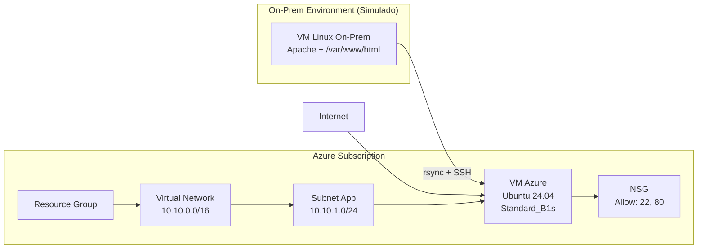

# Diagrama de Arquitectura – Migración On-Prem → Azure (Lift & Shift)

Este diagrama representa visualmente el flujo del laboratorio:

- Servidor On-Premise (simulado en local)
- Migración de archivos usando SSH + rsync
- Infraestructura creada en Azure (VNet, NSG, VM)
- Conexiones internas y externas

---

## Diagrama (Mermaid)

---

## Descripción general

- El servidor On-Prem ejecuta Apache con una aplicación simple.
- Se realiza **Discovery** para conocer su configuración.
- Se crea una infraestructura espejo mínima en Azure.
- Se copian los archivos de `/var/www/` mediante `rsync`.
- Finalmente, se valida el comportamiento de la aplicación.

---

Fin del archivo.

