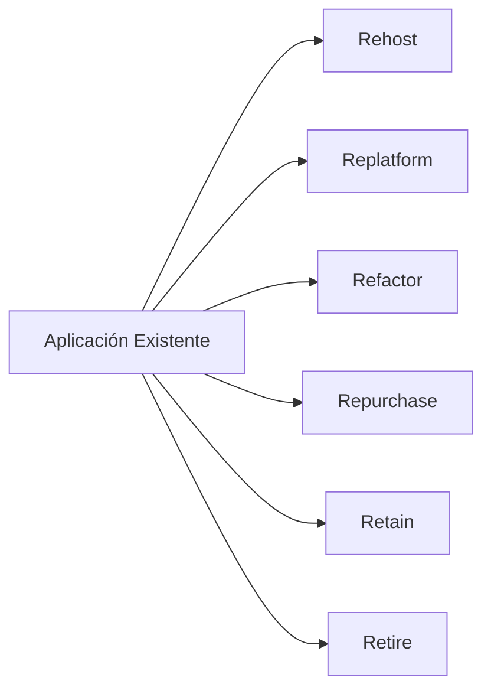

# Modelos de Migración a la Nube (Azure / AWS)

Este documento resume los modelos de migración más usados en la industria, conocidos como las **6 R’s**.  
Son fundamentales en entrevistas y en la planificación real de migraciones.

---

## 1. Lift & Shift (Rehost)

- Migrar la aplicación tal como está, sin cambios en el código.
- Ejemplo: VM Linux On-Prem → VM Linux en Azure.
- Es el modelo usado en este laboratorio.

Ventajas:
- Rápido.
- Bajo riesgo.
- Bajo costo inicial.

Desventajas:
- No aprovecha servicios cloud-native.
- Puede ser más caro a largo plazo si no se optimiza.

---

## 2. Replatform (Lift, Tinker & Shift)

- Migración con mejoras mínimas.
- Se ajusta la arquitectura para usar servicios administrados.

Ejemplos:
- VM On-Prem → Azure App Service
- Base de datos en VM → Azure Database for MySQL

---

## 3. Refactor / Re-architect

- Implica cambios en el código y arquitectura.
- Se convierte una aplicación tradicional en cloud-native.

Ejemplos:
- Migrar a microservicios
- Usar contenedores y Kubernetes
- Adoptar colas, funciones serverless, API gateways

Ventajas:
- Máxima escalabilidad.
- Mejor observabilidad.
- Costos optimizados a largo plazo.

Desventajas:
- Más costoso y complejo.
- Requiere cambios profundos.

---

## 4. Repurchase (Drop & Shop)

- Reemplazar una solución existente por una SaaS.

Ejemplos:
- ERP propio → Dynamics 365
- CRM propio → Salesforce

---

## 5. Retire

- Se eliminan aplicaciones o servicios que ya no son necesarios.

Usado para:
- Reducir complejidad.
- Disminuir costos.
- Modernización enfocada.

---

## 6. Retain (Rehost On-Prem)

- Mantener un sistema On-Prem por razones técnicas o regulatorias.

Ejemplos:
- Mainframes
- Sistemas con requisitos de latencia extrema
- Equipos médicos o industriales

---

## Diagrama conceptual de las 6 R’s

---

Fin del archivo.

